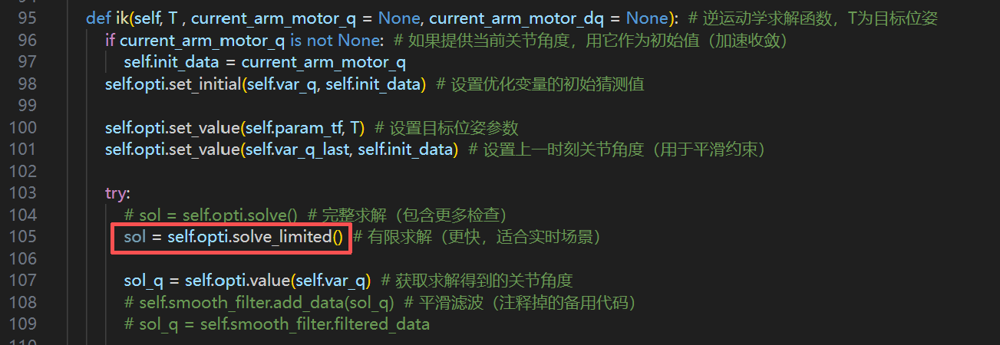
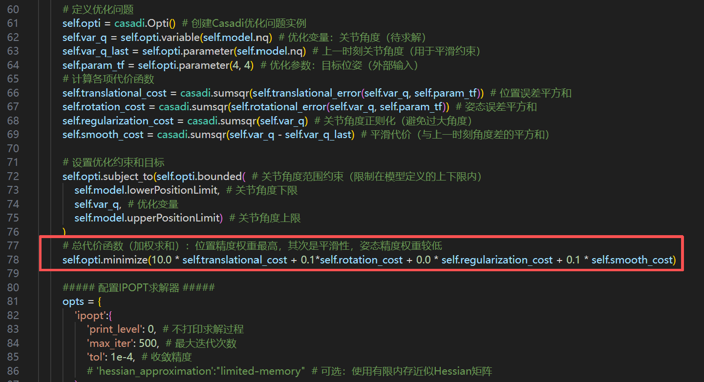
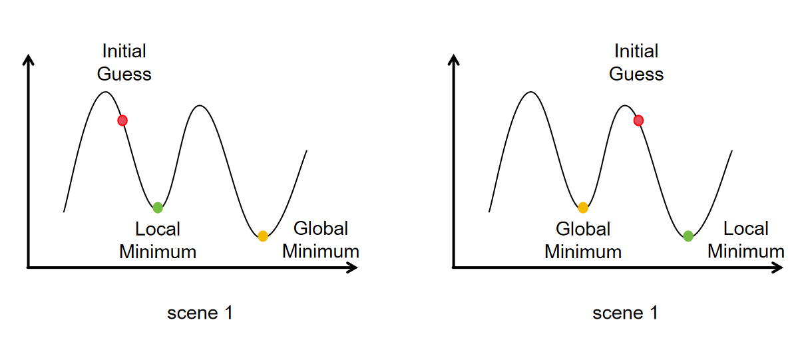

# 使用方法

本项目使用的机械臂是由大然科技公司提供，拥有sdk封装函数，本人只负责了算法实现
```python
# 其中
DrEmpower.py
parameter_interface.py
test.py
# 是大然机械臂的库函数

joystick_debug.py（插上你的手柄运行此脚本可显示手柄实际控制信号，核对之后可在主程序中根据习惯更改）
casadi_ik.py
mujoco_viewer.py
mujoco_sim.py(遥操作单独仿真程序)
joystick_to_real_mujoco.py（主控函数脚本）
# 是我写的算法脚本
```


# Pinocchio+Casadi库的安装方法

## 创建虚拟环境mujoco

- Python=3.10
- 以下操作全部是在虚拟环境当中的操作

## 安装顺序（全部是从源码编译安装）

### 安装mujoco
```bash
git clone https://github.com/google-deepmind/mujoco.git
cd mujoco
mkdir build
cd build
cmake ..
cmake --build . 多线程编译使用 cmake --build . -j线程数
cmake -DCMAKE_INSTALL_PREFIX=../miniconda3/envs/mujoco
sudo cmake --install .
```

### 安装eigenpy

```bash
git clone https://github.com/stack-of-tasks/eigenpy.git
cd eigenpy
mkdir build && cd build
cmake .. \
  -DCMAKE_BUILD_TYPE=Release \
  -DCMAKE_INSTALL_PREFIX=../miniconda3/envs/mujoco \
  -DPYTHON_EXECUTABLE=$(which python)
 
make -j8 
make instal
```

### 安装casadi
```bash
git clone https://github.com/casadi/casadi.git
cd casadi
mkdir build && cd build

sudo apt install swig liblapack-dev libblas-dev -y  
或者  
conda install -c conda-forge swig blas lapack

cmake .. -DCMAKE_BUILD_TYPE=Release \
    -DPYTHON_EXECUTABLE=$(which python) \
    -DCMAKE_INSTALL_PREFIX=../miniconda3/envs/mujoco \
    -DWITH_IPOPT=ON \
    -DWITH_PYTHON=ON
 
make -j$(nproc)
make install
```
### 安装example-robot-data
```bash
pip install example-robot-data
```

### 安装Pinocchio
```bash
git clone https://github.com/stack-of-tasks/pinocchio.git
cd pinocchio
mkdir build && cd build
 
cmake .. \
  -DCMAKE_BUILD_TYPE=Release \
  -DCMAKE_CXX_FLAGS="-I/home/ycn/miniconda3/envs/mujoco/include -L/home/ycn/miniconda3/envs/mujoco/lib" \
  -DCMAKE_INSTALL_PREFIX=/home/ycn/miniconda3/envs/mujoco \
  -DBUILD_WITH_CASADI_SUPPORT=ON \
  -DCMAKE_PREFIX_PATH=/home/ycn/miniconda3/envs/mujoco \
  -DCMAKE_INCLUDE_PATH=/home/ycn/miniconda3/envs/mujoco/include \
  -Dcasadi_DIR=/home/ycn/miniconda3/envs/mujoco/lib/cmake/casadi \
  -DCMAKE_LIBRARY_PATH=/home/ycn/miniconda3/envs/mujoco/lib \
  -DBUILD_TESTING=OFF \
  -DBUILD_EXAMPLES=OFF

 
make -j8
make install
```

# 遥操作方案对比：MoveIt Servo vs. Pinocchio + CasADi

之前想用MoveIt Servo做遥操作来着，但是实时性和ik多解问题一直搞不定，最终查资料决定舍弃MoveIt Servo用Pinocchio + CasADi

MoveIt Servo: 本质上是一个微分逆运动学求解器。它通过雅可比矩阵将笛卡尔空间的速度指令映射到关节空间的速度指令，并内部处理了一些基本的碰撞避免和关节限位。它的问题是求解策略相对固定，在接近奇异点或复杂约束下容易失败。

Pinocchio + CasADi: 这是一个优化问题求解器。你将机器人的运动控制问题建模为一个带约束的优化问题，然后使用 CasADi 的高效求解器（如 IPOPT）来求解。

    目标函数： 例如，末端执行器轨迹跟踪误差最小化。
      
    约束： 例如，关节位置/速度/加速度限位、自碰撞避免、动态障碍物避障等。

| 特性维度 | MoveIt Servo | Pinocchio + CasADi | 胜出方 |
| :--- | :--- | :--- | :--- |
| **开发效率** | **高** (开箱即用) | **低** (需要大量自研) | MoveIt Servo |
| **性能与控制频率** | 中 (受ROS/URDF解析限制) | **高** (C++后端，计算高度优化) | **Pinocchio+CasADi** |
| **灵活性/可定制性** | 低 (框架固定，黑盒) | **极高** (完全自主，白盒) | **Pinocchio+CasADi** |
| **奇异点处理** | 弱 (易卡顿、抖动) | **强** (可通过优化平滑处理) | **Pinocchio+CasADi** |
| **约束处理能力** | 基础 (关节限位，基础碰撞) | **强大** (可轻松添加复杂约束) | **Pinocchio+CasADi** |
| **代码透明度** | 低 (ROS封装，调试复杂) | **高** (所有逻辑可见可控) | **Pinocchio+CasADi** |
| **依赖与复杂度** | **轻** (ROS生态内) | **重** (需要数学/优化知识) | MoveIt Servo |
| **长期维护** | 由ROS社区维护 | **自主维护，与项目深度绑定** | **Pinocchio+CasADi** |

# Casadi解决机械臂求逆解遇到多解的优化问题

## 主程序

集中在casadi_ik.py脚本当中``ik()``函数，代码当中核心部分是



其中，opti.solve_limited()  是如何工作的？-->主要是集中在casadi_ik.py脚本当中的``createSolver()``函数，他创建一个基于优化的逆运动学（IK）求解器



``createSolver()``函数主要有三步：
**定义变量**：你要优化谁（关节角度 `q`）。
**定义代价函数**：你想要什么样的“最优解”（比如末端靠近目标）。
**调用求解器（Solver）**：让算法自动“找出最优的 q”。

## 求解器（Solver）是什么      [是一个 **数学优化算法引擎**]

在这里用的是 **CasADi 的 IPOPT** 求解器

### IPOPT 是什么？

IPOPT（Interior Point OPTimizer）是一个 **非线性优化求解器**，全名叫 **Interior Point Method for Nonlinear Programming**。

它专门用于求解这类问题：
$$
\begin{aligned}
 \min_x & \quad f(x) \
 \text{s.t.} & \quad g(x) = 0 \
 & \quad h_{min} \le h(x) \le h_{max}
 \end{aligned}
$$

- ( x ) 就是关节角 ( q )
- ( f(x) ) 是代价函数（位置、姿态、平滑误差的平方和）
- 约束条件 ( h(x) ) 是关节角度的上下限。

### 它内部在干什么？

IPOPT 是一种 **梯度型非线性优化算法**，它的核心思想是：

> 通过反复迭代，让当前解逐渐“滑向”一个代价函数的最小值点。

#### 步骤 1：初始化

它先从一个初始猜测 ( q_0 ) 开始（就是 `self.init_data`）。

#### 步骤 2：计算梯度（方向）

利用 CasADi 的符号计算能力，
 自动计算出目标函数的梯度和约束的雅可比矩阵：
$$
\nabla f(q), \quad \nabla g(q)
$$
梯度告诉优化器“往哪个方向走会让误差变小”。

#### 步骤 3：构建 KKT 系统

它会把优化问题转成 **KKT 方程组（Karush–Kuhn–Tucker 条件）**，
这个是满足最优解必须满足的条件。

> 求一个点 ( q^* )，在这个点上：
>
> - 代价函数无法再下降；
> - 所有约束都刚好被满足。

#### 步骤 4：牛顿迭代更新

然后它会解下面这个线性方程系统：


$$
H \Delta q = -\nabla f
$$
其中：

- (H) 是 Hessian（目标函数的二阶导数矩阵）；
- ( △ q ) 是下一步该移动的方向 ；
- 通过不断更新$$ ( q_{k+1} = q_k + \alpha \Delta q )$$逐渐逼近最优点。

这一步由下式，在内部自动完成

```python
sol = self.opti.solve_limited()
```

#### 步骤 5：检查收敛条件

每次迭代都会检查：
$$
|\nabla f(q)| < \text{tol}
$$

 也就是“梯度几乎为零”
 → 意味着代价函数在当前点附近已经没有下降方向
 → 算法认为已经到达最优点。

### 为什么是“局部最优解”？

- IPOPT 是基于 **梯度下降 + 牛顿迭代** 的；
- 它**只沿着局部导数信息**前进；



它只会找到“**附近的那个坑底**”（局部最小），
而不会自动跳到全局最小点。

### 那为什么 IK 常常只得到一个解？

在 IK 里，代价函数是连续的，且随初始姿态不同会形成多个“谷底”：

- 肘上解 → 一个谷底
- 肘下解 → 另一个谷底

IPOPT 只能在你当前初始值附近的“谷底”下降，
 所以得到的结果取决于：

```python
self.opti.set_initial(self.var_q, self.init_data)
```

也就是说：

> 初始猜测 ≈ 决定你落在哪个解。

### IPOPT 为什么适合实时 IK？

| 特性                   | 说明                               |
| ---------------------- | ---------------------------------- |
| 使用梯度和 Hessian     | 快速收敛（通常只需几十次迭代）     |
| 内点法处理约束         | 可以保证解不越界（不会超关节限位） |
| CasADi 自动微分        | 无需人工推导导数，数值稳定         |
| “solve_limited()” 模式 | 限制最大迭代步数，实时性强         |

## 整体流程就是：

### **总体目标**

> 给定一个目标末端位姿 ( T_{target} )，
> 求出机械臂的关节角 ( q = [q_1, q_2, ..., q_n] )，
> 使得机械臂的末端尽量到达目标位置和姿态。

数学形式：
$$
\min_q \ | \text{pos}(q) - \text{pos}*{target} |^2 + | \text{rot}(q) - \text{rot}*{target} |^2
$$
同时满足：
$$
q_{min} \le q \le q_{max}
$$

### **程序运行的四个核心阶段**

**① 定义问题**

在 `createSolver()` 中定义了一个 **优化问题 Opti()**。

> “我想让误差最小化，变量是关节角 q。”

主要定义如下：

| 名称         | 作用                         | 对应代码                                         |
| ------------ | ---------------------------- | ------------------------------------------------ |
| **变量**     | ( q )（关节角）              | `self.var_q = self.opti.variable(self.model.nq)` |
| **参数**     | 目标位姿 ( T_{target} )      | `self.param_tf = self.opti.parameter(4, 4)`      |
| **代价函数** | 位置误差 + 姿态误差 + 平滑项 | `self.opti.minimize(...)`                        |
| **约束**     | 关节角上下限                 | `self.opti.subject_to(...)`                      |

**② 构建代价函数**
$$
J(q) =
 10.0 \cdot \text{位置误差}^2 +
 0.1 \cdot \text{姿态误差}^2 +
 0.1 \cdot \text{平滑误差}^2 +
 0.0 \cdot \text{正则项}
$$
具体含义：

| 项目         | 物理意义             | 代码位置                   |
| ------------ | -------------------- | -------------------------- |
| **位置误差** | 保证末端到达目标点   | `self.translational_cost`  |
| **姿态误差** | 保证末端方向对齐     | `self.rotation_cost`       |
| **平滑误差** | 防止抖动，使运动连续 | `self.smooth_cost`         |
| **正则项**   | 避免角度过大（可选） | `self.regularization_cost` |

**③ 调用求解器（IPOPT）**

当执行：

```python
sol = self.opti.solve_limited()
sol_q = self.opti.value(self.var_q)
```

发生了以下事情：

1. CasADi 自动把你定义的误差函数转成数学表达式；
2. IPOPT（求解器）对这些表达式求导；
3. IPOPT 通过迭代（内点法）寻找一个使代价函数最小的 ( q )；
4. 输出最优的关节角 `sol_q`。

**④ 输出结果**

得到的 `sol_q` 是：

> 一组（唯一的）优化结果
> 它是根据你当前提供的初始猜测 + 约束条件
> 在局部范围内找到的一个**最优解（局部最优）**。

### **它不会算出“多个解”**

- **IK 方程** 通常有多个数学解（比如肘上/肘下）。
- 但 **优化器 IPOPT 只会给你一个局部最优解**，而这个解取决于你给的 **初始值（initial guess）**。

| 你给的初始姿态     | 可能得到的结果 |
| ------------------ | -------------- |
| 初始角度接近肘上解 | 得到肘上解     |
| 初始角度接近肘下解 | 得到肘下解     |

所以：

```python
self.opti.set_initial(self.var_q, self.init_data)
```

这一步非常重要，它决定了你最终可能落在哪个“解支”。

